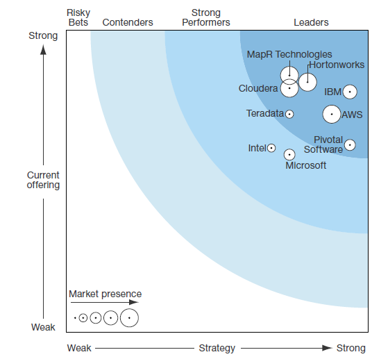
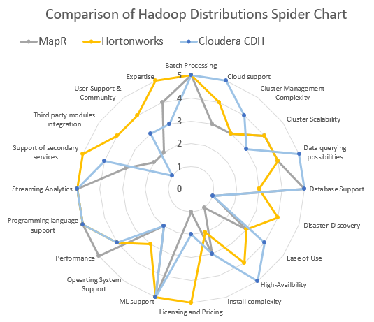
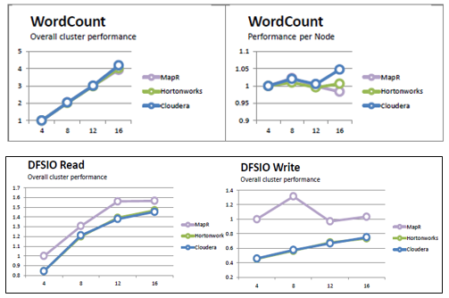
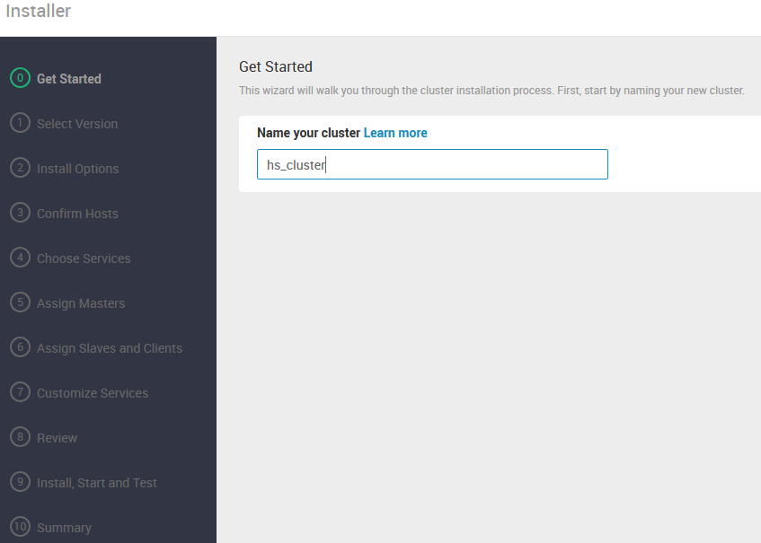
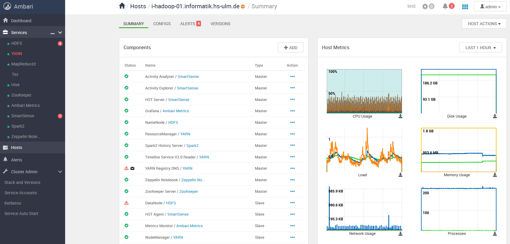

#### Overview ####

- [Hadoop Distributions Overview](#1.-Hadoop-Distributions-Overview)
- [Comparison Criteria](#2.-Definition-of-criteria)
- [Weighted evaluation matrix](#3.-Weighted-evaluation-matrix)
- [Performance comparison](#4.-Performance-Comparison-with-micro-benchmarks)
- [Hadoop installation](#5.-Installation-of-sample-Hadoop-distribution-on-4-VM's)
- [MapReduce Job](#6.-Implement-a-sample-MapReduce-job)
- [Summary](#Abstract)
- [Bibliography](#Sources)

 # **Evaluation of Hadoop Distributions v0.2**
**for Data Science project**
 #### **Abstract**

This paper shows a general conducted comparison of Hadoop distributions which are dominating the Big Data market. Since it is necessary for our data science project to compute in a parallel and efficient fashion, such a comparison helps us to identify the right distribution. Firstly, an overview of the identified distributions with its features and pricing tiers will be shown. Afterwards I will declare some important criteria for our project based on an extensive research of internet blogs and manufacturer websites. Then a weighting of those criteria will be done. These ones will then be used to evaluate the different Hadoop distributions. The resulting evaluation matrix shows that HortonWorks might be the best distribution for our data science problem. However, a detailed look at the performance criterion shows us that MapR is the most performant in overall. For this performance comparison, evaluation results of various MapReduce jobs found on the Internet are used. Hence, in a pure performance comparison MapR would win over HortonWorks, but in an overall comparison HortonWorks convinces more since their distribution is completely open source and also their community is probably the most active one. To round off the evaluation, a test implementation of HortonWorks is carried out on the 4 virtual machines procured for this purpose where some simple MapReduce jobs are carried out.

# 1. Hadoop Distributions Overview

For the first part of the evaluation, a search for widespread Hadoop distributions was conducted [1-5]. As the table below shows, 7 noteworthy distributions were found.

| 
**Hadoop   Distribution** | 
**Features** | 
**Pricing Gear** | 
**Hadoop Ecosystem** |
| :--- | :--------- | :--- | :--- |
| 
 Apache Hadoop 3.1.1  [hadoop.apache.org](http://hadoop.apache.org) | 
No extra tools   Blank installation of Apache Hadoop (HDFS, YARN and Hadoop Web UI)| 
Open Source 100%  | 
Has to be installed manually [6] |
| 
 Cloudera CDH (v 5.15.0) [www.cloudera.com](http://www.cloudera.com) | 
 Oldest distribution   Very polished   Comes with good (and proprietary) tools to install and manage a Hadoop cluster:   Cloudera Manager for managing and monitoring clusters [7].   Cloudera Search (Free-Text) on Hadoop [8].   Apache Crunch framework for MapReduce Pipelines [8].  | 
 Freemium (Cloudera Manager require license). Also source code is not fully available and enterprise edition has 60 trial-day [9]. Final costs may depend on cluster size [4]. | 
 Accumulo, Flume, HBase,  HCatalog, Hive, HttpFS, HUE, Impala, Kafka, KMS, Mahout, Oozie, Pig, Sentry, Snappy, Spark, Sqoop, Parquet, Whirr, ZooKeeper [7, 8] |
| 
 HortonWorks Data Platform (HDP 3.0.1) [www.hortonworks.com](http://www.hortonworks.com) |  
Newer distributions   Tracks Apache Hadoop closely   Comes with standard and open source tools for managing clusters:   Improved HDFS in HDP 2.0: automated failover with a hot standby and full stack resiliency [10].   Ambari for managing and monitoring clusters.   Includes almost all Hadoop extensions from the Apache foundation [10]. | 
 Open Source, optional enterprise paid support [9] | 
 Atlas, HBase, HDFS, Hive Metastore,HiveServer2, Hue, Spark,Kafka, Knox, Oozie, Ranger, Storm, WebHCat, YARN, SmartSense, ZooKeeper [11] |
| 
 MapR 6.1 [www.mapr.com](http://www.mapr.com) | 
 Uses own HDFS (MapR-FS). Integrates own database systems (MapR-DB seven times faster than HBase). Mostly used for big big data projects. Free from Single Point of Failures. Offers Mirroring and Snapshotting. Might be the fastest Hadoop distribution (see section 4).   MapR supports backward compatibility across multiple version of projects. Supports a global event replication for streaming at IoT scale (MapR-ES)| 
 Freemium [12]:Community Edition contains no high availability, no disaster recovery and no global replication for streaming data.  | 
 AsyncHBase, Cascading, Drill, Flume, HBase Client and MapR Database, Binary Tables,, Spark, HCatalog, Hive, HttpFS, Hue, ImpalaMapR Event Store For Apache Kafka Clients and Tools, Myriad, OpenStack, Manila, Oozie, Pig, Sentry, Spark, Sqoop, MapR Object Store with S3-Compatible API [13] |
| 
Intel [www.hadoop.intel.com](http://www.hadoop.intel.com) | 
 Partnered with Cloudera [14]:   Encryption support, Hardware acceleration added to some layers of stack to boost performance and Admin tools to deploy and manage Hadoop | 
 Premium (90 day trial) | 
 Offers same services as Cloudera. |
| 
 Pivotal HD [www.gopivotal.com](http://www.gopivotal.com) |
 Partnered with Hortonworks [14]. Fast SQL on Hadoop. Poprietary Software [15]:   Pivotal DataLoader, SS (external file system), Spring Data, Pivotal ADS-HAWQ (parallel SQL query engine), |
 Premium |
 Offers same services as Hortonworks. |
| 
 IBM Open Platform  [www.ibm.com](http://www.ibm.com) |
 Partnered with Hortonworks [14]. Proprietary tools (IBM Big SQL allows concurrent process of Hive, HBase and Spark and other sources using a single database connection [14]. IBM BigInsights v4.2 provides Text-Analytics module [16] and highly compatible to other IBM products. |
 Free for non-commercial purposes, optional enterprise paid support [17] |
 Offers same services as Hortonworks. |
    

<b>Table 1:</b> Overview of Hadoop distributions

It is worth to mention that each Hadoop distribution in table 1 comes up with a minimum of services from the apache foundation: YARN, HDFS, Hive, Pig, HBase, Kafka, Storm, Mahout, HCatalog… But they may use a proprietary implementation of them e.g. MapR uses own HDFS instead of Apache HDFS implementation. It is also worth to note that a few cloud providers are offering Hadoop cluster services over their platforms. For instance, Microsoft Azure provides with HDInsight a full manageable Hadoop respectively Spark Cluster [18]. The user could profit from fast provisioning and also from less costs since no on-prem hardware cluster infrastructure is required. Therefore, Hadoop (or better Spark) by Cloud Computing is also a mentionable option for our data science project in the future, although it may be oversized at the moment.

Nevertheless, Intel, ERM/Pivotal and IBM partnered with Hortonworks or Cloudera (Table 1). These vendors therefore have the same extensions as their partners offer, but also can provide exclusive tools for users (e.g. IBM Big SQL [14]). If we take this into account, we find that there are mainly 3 different Hadoop distributions: Cloudera with CDH, Hortonworks with its HDP and MapR with its own HDFS.

In addition to the distributions shown in Table 1, there are many other Hadoop distributions such as Altiscale from SAP or Elastic MapReduce from Amazon. Both run only in a cloud environment. The Forrester Wave shows also the three global players Cloudera, HortonWorks and MapR (see figure 1). Since cloud solutions do not play a role for this use case, Microsoft, Google or Amazon will not be considered.

 </img>
 
<b>Figure 1:</b> Forrester Wave of Hadoop Distributions [5]

As we can see from figure 1 the three mentioned Hadoop distributions are building a cluster and Cloudera even overlaps with MapR slightly. That means, they are providing similar products and enjoy a similar market position. From the Forrester Wave (figure 1) we can derive that MapR seems to have the best offering. However, since we want to use one of them for our analytics project we have to dig a step deeper and make a decision based on well-defined criteria.

# 2. Definition of criteria

Hadoop distributions are rated using selected criteria, with scores ranging from 1 (very poor) to 5 (very good). Based on the research carried out, the following 20 clear criteria can be determined:

| **Criterion** | **Description** |
| --- | --- |
| Batch Processing | Batch process jobs can run without any end-user interaction   or can be scheduled to start up on their own as resources permit. |
| Cloud Support | Cloud compatibility of Hadoop distributions. |
| Cluster Scalability | Creating new clusters ad-hoc and set up cluster size (e.g. 4,8 or 12 nodes). |
| Data querying possibilities | Ways to query Hadoop with SQL (e.g. Hive, Stinger, Spark SQL,…). |
| Database Support | Additional databases in Hadoop (e.g. PostgreSQL, MongoDB, HBase, Impala…). |
| Disaster-Discovery | There is a fallback option available in case of unexpected Hadoop errors. |
| Ease of Use | The complexity of the usage of the Hadoop distribution. |
| High-Availbility | Self-healing across multiple services or single failure recovery (i.e. fail-over clusters). |
| Install complexity | Is there a simple installation routine or does it require lot of manual configuration (e.g. Multinode Cluster…)? |
| Licensing and Pricing | Cost model of Hadoop distributions. |
| ML support | Providing interface for enlarged machine learning tasks (e.g. Spark MLlib…). |
| Operating System Support | Guaranteed and certified OS compatibility. |
| Performance | Cluster performance in case of parallelized MapReduce Jobs. |
| Programming Language Support | Support of data science programming languages (Python and R). |
| Streaming Analytics | Vendor offering real-time analytics capabilities (e.g. IoT platform hub..). |
| Support of secondary services | Services on top of Hadoop (e.g. Zookeeper, Spark…). |
| Third party module integration | Usage of additional components from other vendors |
| User Support/Community | How fast is the response in the community? |
| Expertise | Experience with Hadoop (life time of company, …) |

<b>Table 2:</b> Overview of Hadoop distributions 

The weight scale ranges from 1 (trivial) to 4 (very important), with the focus on our Santander Bicycle project. This means that cloud support, for example, is a crucial criterion in many use cases, but has only little importance for our project which leads to a trivial weight. A percentage weighting is not applied because 20 criteria would result in a fine-granular distribution (which is not good to read at all). Therefore, absolute values are used for the comparison table in the next section.

# 3. Weighted evaluation matrix

| **Criteria** | **Weight** | **KO** | **MapR** | **Hortonworks** | **Cloudera CDH** |
| --- | --- | --- | --- | --- | --- |
| Batch Processing | 3 | - | 5 | 5 | 5 |
| Cloud support | 1 |  - | 3 | 4 | 5 |
| Cluster Management Complexity | 4 | -  | 3 | 3 | 4 |
| Cluster Scalability | 2 |  - | 4 | 4 | 3 |
| Data querying possibilities | 3 | - | 4 | 4 | 5 |
| Database Support | 4 |  - | 5 | 3 | 5 |
| Disaster-Discovery | 2 | -  | 1 | 4 | 1 |
| Ease of Use | 2 |  - | 3 | 3 | 4 |
| High-Availbility | 2 |  - | 1 | 4 | 5 |
| Install complexity | 2 | -  | 3 | 2 | 3 |
| Licensing and Pricing | 4 | x | 1 | 5 | 2 |
| ML support | 4 | x | 5 | 5 | 5 |
| Opearting System Support | 4 | x | 2 | 3 | 2 |
| Performance | 4 | x | 5 | 4 | 4 |
| Programming language support | 4 | x | 5 | 5 | 5 |
| Streaming Analytics | 1 | -  | 5 | 5 | 5 |
| Support of secondary services | 3 | -  | 3 | 5 | 4 |
| Third party module integration | 2 |  - | 2 | 4 | 1 |
| User Support &amp; Community | 2 | -  | 2 | 4 | 3 |
| Expertise | 2 |  - | 4 | 5 | 3 |
| **Total Score** | -  | -  | 179 | **209** | 199 |
|

| **legend** |
| --- |
| (bad) 1 |
| (is okay) 2 |
| (mediocre) 3 |
| (good) 4 |
| (ideal) 5 |

<b>Table 3:</b> Weighted Comparison Table of Hadoop Distributions

As already mentioned in Section 1, the three major Hadoop distributions are: Cloudera CDH 5.15.0, Hortonworks HDP 3.0.1 and MapR 6.1.0. With regard to the defined comparison criteria, a weighted decision matrix can be mapped. At the same time, this matrix represents the starting point for the decision of a Hadoop distribution. It cannot be denied that a certain degree of subjectivity is included in the evaluation (Table 2). In addition, only free editions are compared. For example, if a feature only exists in the premium version, this feature will be rated 1 (worst) since we don&#39;t want to waste money.

Table 3 clearly shows that there are almost no significant differences between the selected distributions. Although there are a few deviations such as disaster-discovery or pricing model, the overall distribution of points is relatively the same. From the comparison matrix it can be deduced that Hortonworks HDP achieves the highest score and is probably the best option for our project at the moment. It is possible that after the first test phase (see Chapter 5), it turns out that the distribution is not convenient after all which may require to update the evaluation matrix. Therefore table 3 can be considered as a continuous iterative updateable weighted comparison matrix that will likely be updated on further sprints.

Another representation of the evaluated Hadoop distributions, a spider chart may be appropriate as it makes it easier to read and to identify outliers or similarities even quicker as with a raw table.

</img>

<b>Figure 2:</b> Spider chart of compared Hadoop distributions

The KO criteria from table 3 are all satisfied by the selected Hadoop vendors. One criterion that stands out is the license model, which was rated with 1 point for MapR and 2 points for Cloudera. This is due to the fact that the price models of both vendors are not transparent. So Cloudera offers a free community edition but to use the Cloudera Manager (the real strength of Cloudera) you have to pay again. Only Hortonworks offers a complete Open Source package with except the Hortonworks business support is fee required. However, Hortonworks has a very active community as well.

MapR comes off worst with the criterion &quot;Support of secondary services&quot;, because there is no Spark and HBase support in the &quot;Converged Community Edition&quot; [12], but both are important Hadoop components for our project. So if we wanted to use MapR, we would have to use the paid version. There are also some other differences in figure 2 such as Disaster-Recovery which is only on Hortonworks&#39;s HDP completely free.

An interesting aspect of the comparison is the performance criterion where MapR has the most points. Since this criterion is a KO-criterion that means it is a very important component for our project, it makes sense to examine the performance comparison between the distributions in a more detail fashion.

# 4. Performance Comparison with micro benchmarks

For a performance comparison it is good to know how fast they are compute when running in a concurrent mode. For this task MapReduce Jobs like WordCount or DFSIO Read/Write might be helpful. Following figures are extracted from a sophisticated evaluation work by Altoros [19].

</img>

<b>Figure 3:</b> Micro benchmarks on DFSIO and WordCount MapReduce Jobs

For the performance comparison of figure 3 Hadoop cluster each one with 16 nodes have been established in order to measure computation time. Interesting point is that all 3 Hadoop distributions almost achieve the same overall speed on the famous WordCount MapReduce job. But if we look at the performance per node then there is a small difference between them. This could be due to a certain error rate in the execution of the job. If the same test were repeated, the results would be negligibly different. The DFSIO Read/Write (figure 3) job shows MapR is definitely faster than Hortonworks and Cloudera. The reason for this might be the fact that MapR uses its own HDFS which is according to the vendor seven times faster than the original one from Apache. This is the reason why it gets 5 points in the evaluation matrix (see table 2) and the other ones only 4 points. Hortonworks and Cloudera seems to have the same performance on the DFSIO job because both using Apache HDFS.

In overall, Hortonworks HDP wins the competition for the moment, because they have the longest experience and are completely compatible with secondary services. Based on the evaluation matrix from chapter 3 and the performance measurements, it can be deduced that MapR is the most powerful Hadoop distribution on the market today, but when considering the other criteria, Hortonwork&#39;s Hadoop is simply more convincing. Especially the complete Open Source guarantee at Hortonwork is a decisive criterion for the choice of this distribution.

Beside from the comparison, I would generally recommend to use rather Spark than Hadoop since Spark is around 100 times faster due to in-memory processing. Also Spark provides the most important libraries (ML, Streaming …) for data science and works well on top of Hadoop (thanks YARN). It can even be installed in a standalone manner, even though it doesn&#39;t benefit from distributive multimode computing.

# 5. Installation of sample Hadoop distribution on 4 VM&#39;s

Hortonworks offers a configurator on their website that can be used to check products, operating systems, databases, browsers, JDKs and supported processors. It is noticeable that Ubuntu is only supported up to 16.04 LTS. However, our VMs are already v.18.4 LTS. This means Hortonworks does not official support our installed OS [20]. Also Cloudera CDH 5.15 [21] and the newest MapR 6.1 distribution [22] only support Ubuntu 16.04 LTS (Xenial). Anyway, it is still a try worth to set up Hortonworks Hadoop Data Platform (HDP) Cluster on our virtual machines since the vendors are not explicitly warning Ubuntu 18.04 is not supported. So it may work. For the installation of HDP 3.0.1 the Ambari Wizard [23] will be used.

First of all, we have to configure the **etc/hosts** since every node in the cluster must be able to communicate with each other. The hosts file should look like this:

| IP-Adress | Hostname |
| --- | --- |
| 127.0.0.1  | localhost |
| 141.59.29.111 | i-hadoop-01.informatik.hs-ulm.de i-hadoop-01 |
| 141.59.29.112 |i-hadoop-02.informatik.hs-ulm.de i-hadoop-02| 
| 141.59.29.113 | i-hadoop-03.informatik.hs-ulm.de i-hadoop-03 | 
| 141.59.29.114 | i-hadoop-04.informatik.hs-ulm.de i-hadoop-04 |

<b>Table 4:</b> etc/hosts configuration file

After that step, it is necessary to add public key authentication with SSH. The master node ( **i-hadoop-01** )should login to its worker nodes without using a password. We can achieve this goal by generating a private / public key pair and distribute the public key to the 3 worker nodes by using **ssh-copy-id** command. Also for using Ambari the Hadoop user need sudo execution without password. Adding an additional line to **visudo** configuration file should solve that issue.

At next, all nodes need to have Java installed. Since Ubuntu 18.04 doesn&#39;t come up with a default Java JDK we install Oracle JDK 1.8 manually on each node. After that it is time to download the Ambari repository file ([http://publicrepo-1.hortonworks.com/ambari/ubuntu16/2.x/updates/2.7.1.0/ambari.list](http://publicrepo-1.hortonworks.com/ambari/ubuntu16/2.x/updates/2.7.1.0/ambari.list)) to a directory on our Hadoop master host. The Ambari v. 2.7.1.0 is used for installation. With the command **apt-get install ambari server** the server will be installed on i-hadoop-01. Afterwards, we can start the server. Now we can go to the Ambari surface via following link: [http://i-hadoop-01.informatik.hs-ulm.de:8080](http://i-hadoop-01.informatik.hs-ulm.de:8080). The default login credentials are **admin admin**. After successful login, the real installation process begins.

</img>

<b>Figure 4:</b> Ambari Wizard Installer

Next, we click through the installation routine until the point appears where the cluster nodes are defined. At this point the fact that we are using Ubuntu 18.04 will cause some troubles. If we adding the hosts Ambari is trying to check some dependencies and is running also some check routines. It will fail to add the worker nodes to the cluster since OS is not supported (termination condition). The solution to this problem would be a downgrade of the OS but we don&#39;t have the privileges to do this. So I manually changed the **/etc/issue** , **etc/lsb-release** and **etc/os-release** file to Ubuntu 16.04 version. Of course, a backup of the original ones has been created as well. After this workaround, the check condition will not fail because Ambari consider our OS as Ubuntu 16.04. Obviously, that&#39;s a dangerous operation, so we change it back to original state after installation has been completed.

In the next step we are choosing our Hadoop services that may be relevant for our data science project. For a start we choose following services: HDFS, YARN, MapReduce2, Tez, Hive, ZooKeeper, Ambari Metrics, SmartSense, Spark2 and Zeppelin Notebook. Interesting to see is that the proprietary service SmartSense is the only one that cannot be deselected. We have to install it, even if we don&#39;t want to use it. That&#39;s certainly not very user-friendly. However, it is simple to add further Apache services on running Ambari but more difficult to uninstall them so that I am not enabling all possible Hadoop services from the beginning. In addition, some services are not for interest at the moment so they would only consume storage without having a practical effect.

After some additional configuration steps we can choose which services should run on master or worker nodes. Also we have to decide which node should be data node and node manager. In this cluster configuration all 4 VMs are data nodes as well as node managers. A database connection is also mandatory at this step. Depending on selected services there are several database connections. For instance, the service Hive needs a working SQL database connection. We can choose between MySQL (MariaDB), PostgreSQL and Oracle. For a first test, MySQL is used as Hive database. We can change the database connection setting on Ambari at any time.

If the configuration has been finished, a summary with all decisions taken is shown. That&#39;s the last possibility to change a fundamental Hadoop setting. It is worth to check all configurations carefully. Afterwards there is no go back option and the uninstall routine of Ambari is complicated and might lead to tremendous work of removing operations. That is also negative criteria of HDP and Ambari.

As soon as the installation completes we can switch to the Ambari monitor. Unfortunately, almost all selected services were offline or could not start properly. A deeper investigation showed that there were some permission problems with HDFS and the Hadoop user. The HDFS folder was only for root user but not for user &quot;Hadoop&quot;. With the command **chown -R hdfs:hadoop /hadoop/hdfs** the correct permissions could be granted.

Another problem was that YARN could not start the name nodes due to connection refused error messages. As **netstat -tupln | grep 50070** shown the service was only running for localhost address. After changing the binding address to **0.0.0.0** on HDFS, the communication between the cluster nodes was working and the name nodes could properly start. However, after fixing this issue, the most services were running. The community of Hortonworks was quite helpful in this case. I got an answer within 4 hours whereas for getting an answer in Cloudera&#39;s community took 3 times longer.

The data node from the master node was not running correctly. It could be started from Ambari and after few seconds the data node went offline. A look at the error log of this node shown that the cluster id is already used by another node. Removing the HDFS data folder of the data node solved this issue because afterwards it generates a new cache file with a new cluster id.
Following screenshot shows a (successful) completed Ambari and HDP installation on our VMs.

</img>

<b>Figure 5:</b> Ambari Surface, Host metrics on master node

Ambari has been set up and most Hadoop services are running (see Figure 4). Ambari shows lot of statistics that might be helpful for cluster management. We can control each service and either turn it off or set it into a maintenance mode. The ladder one encapsulates the service without influencing other services (high availability). Overall, Ambari is a powerful Hadoop cluster management tool that has lot of control options and supervising tools but also lacks in removing services and usability (e.g. no Ubuntu 18.04 support, only Python 2.7.x support…). The fact, that there is no official uninstaller from Hortonworks makes HDP with Ambari a risky installation. On the other hand, it is completely open source and has a strong community. Furthermore, HDP 3.0.1 comes up with a bunch of useful services and well documentation so that we will likely stay on HDP.

# 6. Implement a sample MapReduce job

# Sources
[1] B. Marr, &quot;Big Data​: Who Are The Best Hadoop Vendors In 2017?

Available on: [https://www.linkedin.com/pulse/big-data-who-best-hadoop-vendors-2017-bernard-marr](https://www.linkedin.com/pulse/big-data-who-best-hadoop-vendors-2017-bernard-marr),&quot; ed, 2017.

[2] M. Gualtieri, N. Yuhanna, H. Kisker, and D. Murphy, &quot;The Forrester Wave™: Big Data Hadoop Solutions, Q1 2014,&quot; ed: Forrester, 2014.

[3] G. Kirill, &quot;Comparing the top Hadoop distributions

Available on: [https://www.networkworld.com/article/2369327/software/comparing-the-top-hadoop-distributions.html](https://www.networkworld.com/article/2369327/software/comparing-the-top-hadoop-distributions.html),&quot; ed, 2014.

[4] Cloudera, &quot;Cloudera - Flexible pricing and licensing options

Available on: [https://www.cloudera.com/products/pricing.html](https://www.cloudera.com/products/pricing.html),&quot; ed, 2018.

[5] M. Heo, &quot;Hortonworks vs. Cloudera vs. MapR

Available at: [http://mungeol-heo.blogspot.com/2015/01/hortonworks-vs-cloudera-vs-mapr.html](http://mungeol-heo.blogspot.com/2015/01/hortonworks-vs-cloudera-vs-mapr.html),&quot; ed, 2014.

[6] A. Foundation, &quot;Hadoop

Available on: [https://hadoop.apache.org/](https://hadoop.apache.org/),&quot; ed, 2018.

[7] Cloudera, &quot;CDH Components

Available on: [https://www.cloudera.com/products/open-source/apache-hadoop/key-cdh-components.html](https://www.cloudera.com/products/open-source/apache-hadoop/key-cdh-components.html),&quot; ed, 2018.

[8] Cloudera, &quot;Installing CDH 5 Components

Available on: [https://www.cloudera.com/documentation/enterprise/5-13-x/topics/cdh\_ig\_cdh5\_comp\_install.html](https://www.cloudera.com/documentation/enterprise/5-13-x/topics/cdh_ig_cdh5_comp_install.html),&quot; ed, 2018.

[9] D. Kumar, &quot;Since Cloudera and Hortonworks are 100% open source, can I use them freely as I would a Linux distribution?

Available on: [https://www.quora.com/Since-Cloudera-and-Hortonworks-are-100-open-source-can-I-use-them-freely-as-I-would-a-Linux-distrubution](https://www.quora.com/Since-Cloudera-and-Hortonworks-are-100-open-source-can-I-use-them-freely-as-I-would-a-Linux-distrubution),&quot; ed, 2017.

[10] Hortonworks, &quot;Grundlagen der HDP-Sandbox

Available on: [https://de.hortonworks.com/tutorial/learning-the-ropes-of-the-hortonworks-sandbox/](https://de.hortonworks.com/tutorial/learning-the-ropes-of-the-hortonworks-sandbox/),&quot; ed, 2018.

[11] Hortonworks, &quot;Starting HDP Services

Available on:

[https://docs.hortonworks.com/HDPDocuments/HDP2/HDP-2.6.5/bk\_reference/content/starting\_hdp\_services.html](https://docs.hortonworks.com/HDPDocuments/HDP2/HDP-2.6.5/bk_reference/content/starting_hdp_services.html),&quot; ed, 2018.

[12] MapR, &quot;MapR Editions.

Available on: [https://mapr.com/products/mapr-distribution-editions/](https://mapr.com/products/mapr-distribution-editions/),&quot; ed, 2018.

[13] MapR, &quot;MapR 6.1 Documentation

Available on: [https://mapr.com/docs/home/c\_ecosystem\_intro.html](https://mapr.com/docs/home/c_ecosystem_intro.html),&quot; ed, 2018.

[14] M. Adrian, &quot;IBM Ends Hadoop Distribution, Hortonworks Expands Hybrid Open Source

Available on: [https://blogs.gartner.com/merv-adrian/2017/06/21/ibm-ends-hadoop-distribution-hortonworks-expands-hybrid-open-source/](https://blogs.gartner.com/merv-adrian/2017/06/21/ibm-ends-hadoop-distribution-hortonworks-expands-hybrid-open-source/),&quot; ed, 2017.

[15] Pivotal, &quot;Overview of Apache Stack and Pivotal Components

Available on: [http://pivotalhd-210.docs.pivotal.io/doc/1110/OverviewofApacheStackandPivotalComponents.html](http://pivotalhd-210.docs.pivotal.io/doc/1110/OverviewofApacheStackandPivotalComponents.html),&quot; ed, 2018.

[16] I. K. Center, &quot;IBM BigInsights

Available on: [https://www.ibm.com/support/knowledgecenter/en/SSPT3X\_4.2.0/com.ibm.swg.im.infosphere.biginsights.product.doc/doc/bi\_features\_architecture.html](https://www.ibm.com/support/knowledgecenter/en/SSPT3X_4.2.0/com.ibm.swg.im.infosphere.biginsights.product.doc/doc/bi_features_architecture.html),&quot; ed, 2018.

[17] IBM, &quot;IBM Hadoop Testversions

Available on: [https://www.ibm.com/analytics/de/de/technology/hadoop/hadoop-trials.html#start-trial](https://www.ibm.com/analytics/de/de/technology/hadoop/hadoop-trials.html#start-trial),&quot; ed, 2018.

[18] Microsoft, &quot;Manage Hadoop clusters in HDInsight by using the Azure portal,&quot; _Available on:_ [_https://docs.microsoft.com/en-us/azure/hdinsight/hdinsight-administer-use-portal-linux_](https://docs.microsoft.com/en-us/azure/hdinsight/hdinsight-administer-use-portal-linux)_,_ 2018.

[19] Altoros, &quot;Hadoop Distributions: Evaluating Cloudera, Hortonworks, and MapR in Micro-benchmarks and Real-world Applications,&quot; pp. 1 - 65, 2013.

[20] Hortonworks, &quot;Supportmatrix Hortonworks

Available on: [https://supportmatrix.hortonworks.com/](https://supportmatrix.hortonworks.com/),&quot; ed, 2018.

[21] Cloudera, &quot;Operating System Requirements

Available on: [https://www.cloudera.com/documentation/enterprise/6/release-notes/topics/rg\_os\_requirements.html](https://www.cloudera.com/documentation/enterprise/6/release-notes/topics/rg_os_requirements.html),&quot; ed, 2018.

[22] MapR, &quot;Operating System Support Matrix (MapR 6.x)

Available on: [https://mapr.com/docs/61/InteropMatrix/r\_os\_matrix\_6.x.html](https://mapr.com/docs/61/InteropMatrix/r_os_matrix_6.x.html),&quot; ed, 2018.

[23] Hortonworks, &quot;Apache Ambari Installation

Available on: [https://docs.hortonworks.com/HDPDocuments/Ambari-2.7.1.0/bk\_ambari-installation/content/ch\_Getting\_Ready.html](https://docs.hortonworks.com/HDPDocuments/Ambari-2.7.1.0/bk_ambari-installation/content/ch_Getting_Ready.html),&quot; ed, 2018.

